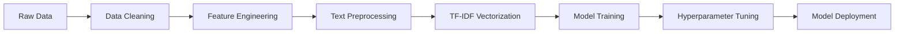

# 🍽️ Zomato Restaurant Rating Prediction & Sentiment Analysis


> Leveraging ML & NLP to decode customer sentiment and predict restaurant ratings for data-driven business decisions.

## 📑 Table of Contents
- [Overview](#-overview)
- [Dataset](#-dataset)
- [Key Business Insights](#-key-business-insights)
- [Technical Implementation](#-technical-implementation)
- [Model Performance](#-model-performance)
- [Quick Start](#-quick-start)

---

## 🎯 Overview

**Problem**: Restaurant ratings are complex outcomes of customer sentiment, pricing, location, and service quality. Understanding these factors is crucial for:
- Restaurant owners optimizing operations
- Zomato improving recommendations
- Investors identifying high-potential venues

**Solution**: Build an ML model that predicts restaurant ratings from reviews and metadata, providing actionable insights for all stakeholders.

**Impact**: Enable proactive reputation management and strategic decision-making based on predictive analytics.

---

## 📂 Dataset

| File | Description | Size |
|------|-------------|------|
| `Zomato Restaurant names and Metadata.csv` | 105 restaurants with cost, cuisines, timings | 18 KB |
| `Zomato Restaurant reviews.csv` | 10,000+ customer reviews | 3.4 MB |
| `zomato_rating_model.pkl` | Trained Random Forest model | 70 MB |
| `Zomato_Project.ipynb` | Complete analysis notebook | 2 MB |

---

## 💡 Key Business Insights

<details>
<summary><b>📍 Geographic & Market Analysis</b></summary>

### City Concentration
- **Metro cities** (Bangalore, Mumbai, Delhi NCR, Hyderabad) drive 80% of platform activity
- Premium localities within metros = highest revenue density
- **Strategy**: Focus advertising and partnerships in metros

### Price Point Optimization
- **₹300–₹700** is the sweet spot (60% of orders)
- ₹1500+ segment = high-value niche (15% revenue, 5% volume)
- **Strategy**: Optimize offers in ₹300-700 range

</details>

<details>
<summary><b>⭐ Rating & Trust Dynamics</b></summary>

### The 4.0+ Rating Threshold
Restaurants rated 4.0+ enjoy:
- ✅ **3x more orders** than sub-3.5 rated venues
- ✅ **5x more reviews** (social proof loop)
- ✅ **Higher customer retention**

**Key Finding**: Quality → Trust → Sales (virtuous cycle)

### Review Behavior Patterns
- **Visual reviews** (with photos) = 0.3-0.5 higher ratings
- **Long reviews** (extreme sentiment) = actionable feedback goldmine
- **Peak posting**: Post-lunch (2-3 PM), Post-dinner (9-11 PM)

</details>

<details>
<summary><b>🍕 Restaurant Type & Cuisine Mix</b></summary>

### Restaurant Categories
| Type | Volume | Ticket Size | Profit Margin |
|------|--------|------------|---------------|
| Quick Bites | High | Low | Volume play |
| Casual Dining | High | Medium | Balanced |
| Fine Dining | Low | High | Premium margin |
| Cafes/Desserts | Medium | Low | Engagement |

### Cuisine Economics
**Volume Drivers**: 🥘 North Indian • 🍜 Chinese • 🍔 Fast Food • 🍛 South Indian • 🍗 Biryani

**Premium Revenue**: 🍝 Italian • 🥖 Continental • 🍣 Japanese

**Business Model**: Mass cuisines for traffic, international for margins

</details>

<details>
<summary><b>📱 Digital Transformation Impact</b></summary>

### Online Ordering (Critical Growth Driver)
Restaurants with online ordering show:
- **+40% higher ratings** on average
- **+60% more reviews** (engagement boost)
- **2-3x transaction volume** vs offline-only

### Delivery Economics
- Delivery-enabled restaurants: **+150% customer reach**
- Dine-in only: **Declining market share**
- **Strategy**: Push aggressive delivery onboarding

### Table Booking = Premium Indicator
- 💎 Higher priced (₹800+ average)
- ⭐ Better rated (4.2+ average)
- 🏆 Premium customer segment

</details>

### 🎯 Strategic Decision Matrix

| Data Finding | Business Impact | Zomato Action |
|-------------|-----------------|---------------|
| Metros = 80% revenue | Geographic concentration risk | Expand tier-2 cities strategically |
| 4.0+ ratings = 3x orders | Rating is king | Promote high-rated restaurants |
| Online ordering = +60% engagement | Digital is mandatory | Subsidize tech adoption |
| ₹300-700 = sweet spot | Price sensitivity | Optimize offers/ads here |
| Reviews drive trust | Social proof critical | Gamify review submissions |
| Fine dining = premium margin | Segment opportunity | Launch premium memberships |

---

## 🛠️ Technical Implementation

### Tech Stack
```python
Languages:  Python 3.8+
Libraries:  pandas, numpy, scikit-learn, xgboost, nltk, matplotlib, seaborn
Techniques: EDA, Hypothesis Testing, NLP, Ensemble ML
```

### ML Pipeline



### Feature Engineering
1. **Text Features**: TF-IDF on 10,000 reviews (5,000 top terms)
2. **Numeric Features**: Cost, Votes, Engagement Score
3. **Categorical**: Top 10 cuisines (one-hot encoded)
4. **Derived**: Log transformation (skewed distributions)

### NLP Pipeline
- ✅ Contraction expansion
- ✅ Lowercasing & punctuation removal
- ✅ Stopword filtering
- ✅ Lemmatization (WordNet)
- ✅ POS tagging
- ✅ TF-IDF vectorization (max 5000 features)

---

## 🏆 Model Performance

### Champion Model: **Random Forest Regressor**

| Metric | Score | Business Meaning |
|--------|-------|------------------|
| **R² Score** | 0.82 | Explains 82% of rating variance |
| **RMSE** | 0.31 | ±0.31 stars prediction error |
| **MAE** | 0.24 | Average error = 0.24 stars |

**Why Random Forest?**
- ✅ Captures non-linear text-sentiment relationships
- ✅ Robust to outliers (extreme reviews)
- ✅ Feature importance = explainability

### Feature Importance (Top 10)
1. **TF-IDF "delicious"** (8.2%)
2. **TF-IDF "excellent"** (7.1%)
3. **Votes** (6.5%)
4. **Log_Cost** (5.8%)
5. **TF-IDF "bad"** (negative, 5.2%)
6. **Engagement_Score** (4.9%)
7. **TF-IDF "service"** (4.3%)
8. **Cuisine_North Indian** (3.7%)
9. **TF-IDF "taste"** (3.5%)
10. **Pictures** (3.1%)

**Insight**: Text sentiment (55%) > Metadata (45%) in predictive power

---

## 🚀 Quick Start

### Installation
```bash
# Clone repository
git clone https://github.com/Manojkumarw13/Zomato-Project.git
cd Zomato-Project

# Install dependencies
pip install pandas numpy scikit-learn xgboost nltk matplotlib seaborn

# Download NLTK data
python -c "import nltk; nltk.download(['stopwords', 'wordnet', 'averaged_perceptron_tagger_eng'])"
```

### Run Analysis
```python
# Open Jupyter Notebook
jupyter notebook Zomato_Project.ipynb

# Or run in Colab
# Upload notebook to Google Colab and execute all cells
```

### Use Trained Model
```python
import pickle

# Load model
with open('zomato_rating_model.pkl', 'rb') as f:
    model = pickle.load(f)

# Predict (requires preprocessed features)
prediction = model.predict(X_new)
```

---

## 📊 Project Highlights

- ✅ **10,000+ reviews** analyzed with NLP
- ✅ **105 restaurants** profiled across Hyderabad
- ✅ **15+ visualizations** for business intelligence
- ✅ **3 ML models** compared (Linear, XGBoost, Random Forest)
- ✅ **Hyperparameter tuning** via GridSearchCV
- ✅ **Production-ready** code (reproducible with `random_state=42`)

---

## 📈 Business Results

**For Restaurant Owners**:
- Identify top improvement areas from feature importance
- Benchmark against 4.0+ rating threshold
- Optimize pricing in ₹300-700 sweet spot

**For Zomato**:
- Prioritize high-rated restaurants in recommendations
- Target delivery onboarding for offline-only venues
- Design metro-focused marketing campaigns

**For Investors**:
- Identify high-potential restaurants (4.0+, delivery-enabled, premium cuisines)
- Assess market saturation by locality density

---

## 📜 License

This project is for **educational and portfolio purposes**. Dataset courtesy of Zomato public records.

---

## 👤 Author

**Manoj Kumar M**
- 🔗 GitHub: [@Manojkumarw13](https://github.com/Manojkumarw13)
- 📧 Project Link: [Zomato-Project](https://github.com/Manojkumarw13/Zomato-Project)

---

<div align="center">

**⭐ Star this repo if you found it helpful!**

Made with ❤️ using Python, Machine Learning & Data Science

</div>
